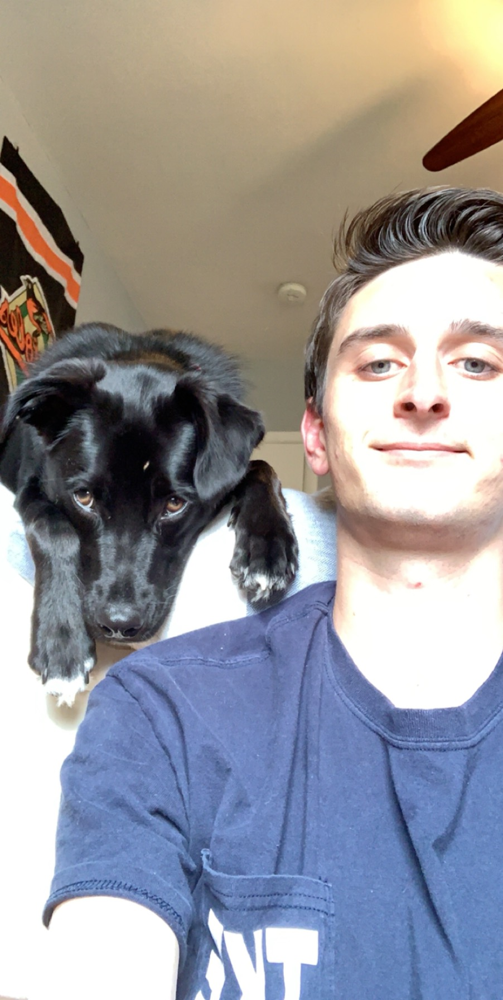

```{r setup, include=FALSE}
knitr::opts_knit$set(eval = TRUE)
```


## About The Team

Team Name:
**P-Hackers**

Team Picture:


Team Goals:   
As a team

---
### Declan Franklin (Section 001)
**Picture:**

```{r, out.width = "400px", message=FALSE}

```
 

**My Non-Statistical Question That Can Be Answered With Data Analysis:**

What's the difference between Statistics and Data Analysis(Honestly)?


**After College Goals:**

6 months after Boulder I want to be in a smaller apartment either in Denver or back home in Baltimore teaching kids with dyslexia computer science and math. 5 Years after Boulder, I'm hoping I'll have my masters and a career in data science that helps me get my PHD.


**My Greatest Career Accomplishment:**

I don't necissarly expect to find the cure for cancer, but all I really want to do is pursue a career where I can help make other peoples lives less stressful.


**My Course Goal:**

My overarching goal is to gain a strong feeling of comfortablility while using RStudio. I want put my use my experince with RStudio as a means of computing data that hopfully the world can use one day.


**Personal:**

I used to want to be an engineer. After a summer of Interning with A Mechanical Engineering company called Poole and Kent, I realized it wasn't for me. Interning, as many know, manily involves paper work. To make my life easier and more orgainized, I work with LaTex the whole summer. I created User manuals, Warranty Letters, Payments orders, etc. The exposer to code sparked som fire within me to pursue data science.  


**Give Declan Feedback below:**

Julia: I liked that you organized everything in an easy to read manner. Next time, you could try to make sure that everything is properly spelled and throughly answered so it is easier for the reader to read. You seem to know what you are doing and have a good foundation on how to use R so that is good. 


---
### Julia Foley

**Picture**


 **Question that can be answered with Data Analysis**

What Country is the cheapest to vacation to/in?

**After College Goals**

Six months after Graduation, I would like to be in law school. Five years later, I would like to be working for the FBI as an Intelligence Analyst. 

**My Greatest Career Accomplishment**

I hope that my greatest career accomplishment is that I can write a book about the minds of the criminals I have caught and what it is like interacting with them. 

**My Course Goal**

I am hoping to learn more about coding and Data Science. Data Science is a useful tool no matter what career path you choose.

**Personal**

When I retire, I want to live off the grid and travel the world.

**Give Julia Feedback Section**


---
### Thomas Neal

**Picture**


**Data science question**

Can data science be used to predict future events based on past data? For example, by tracking the stock market can you then write a program to predict future market trends.

**Post College Goals**

Six months after college I want to have a steady job making good pay and have enough time to work on my projects. 5 years after college I want to be running my own company selling something I invented/created.

**My Greatest Career Accomplishment**

I want to create self-erecting "3D Printers" capable of building cheap and reliable infrastructure. Then help improve the infrastructure in underdeveloped countries. 

**My Course Goal**

I am hoping to decide if data science is for me.

**Personal**
I think within the next 10 years automation will be taking many many jobs. I think you will either be making robots or losing your job to them. 

**Thomas' Feedback**

Julia: I like how thorough your answers are. Maybe next time, have your answers follow the same layout and capitalization. I like how your about me section is easy to read.


=======


>>>>>>> Stashed changes
---
