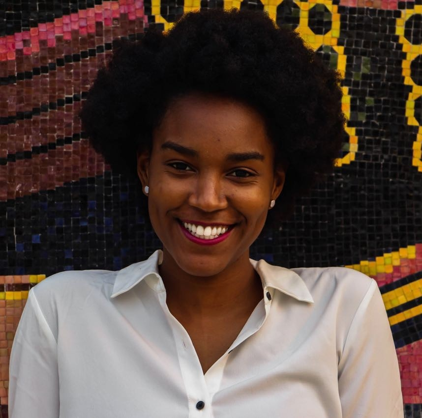

```{r setup, include=FALSE}
knitr::opts_knit$set(eval = TRUE)
```


## About The Team

**Team Name:**
P-Hackers

**Team Picture:**


**Team Goals:** 
As a team, we would like to learn how to effectively communicate data and information through R. We would like to understand the basics of Data Science. Additionally, We would like to understand how to apply it to an actual project.

---
### Declan Franklin (Section 001)
**Picture:**

```{r, out.width = "400px", message=FALSE}
knitr::include_graphics("Me.JPG")
```
 

**My Non-Statistical Question That Can Be Answered With Data Analysis:**

What's the difference between Statistics and Data Analysis(Honestly)?


**After College Goals:**

6 months after Boulder I want to be in a smaller apartment either in Denver or back home in Baltimore teaching kids with dyslexia computer science and math. 5 Years after Boulder, I'm hoping I'll have my masters and a career in data science that helps me get my PHD.


**My Greatest Career Accomplishment:**

I don't necissarly expect to find the cure for cancer, but all I really want to do is pursue a career where I can help make other peoples lives less stressful.


**My Course Goal:**

My overarching goal is to gain a strong feeling of comfortablility while using RStudio. I want put my use my experince with RStudio as a means of computing data that hopfully the world can use one day.


**Personal:**

I used to want to be an engineer. After a summer of Interning with A Mechanical Engineering company called Poole and Kent, I realized it wasn't for me. Interning, as many know, manily involves paper work. To make my life easier and more orgainized, I work with LaTex the whole summer. I created User manuals, Warranty Letters, Payments orders, etc. The exposer to code sparked som fire within me to pursue data science.  


**Give Declan Feedback below:**

From Julia: I liked that you organized everything in an easy to read manner. Next time, you could try to make sure that everything is properly spelled and throughly answered so it is easier for the reader to read. You seem to know what you are doing and have a good foundation on how to use R so that is good. 

From Thomas: I can strongly relate to your Career goals. I would also consider fleshing out your answers more.

---
### Julia Foley

**Picture**
```{r, out.width = "400px", message=FALSE}
knitr::include_graphics("me1.jpg")
```

 **Question that can be answered with Data Analysis**

What Country is the cheapest to vacation to/in?

**After College Goals**

Six months after Graduation, I would like to be in law school. Five years later, I would like to be working for the FBI as an Intelligence Analyst. 

**My Greatest Career Accomplishment**

I hope that my greatest career accomplishment is that I can write a book about the minds of the criminals I have caught and what it is like interacting with them. 

**My Course Goal**

I am hoping to learn more about coding and Data Science. Data Science is a useful tool no matter what career path you choose.

**Personal**

When I retire, I want to live off the grid and travel the world.

**Give Julia Feedback Section**
1) You jumped into this project right away, and became a roll model for others. Thank you for also scratching the answers off on the TRat. 

From Thomas: You set a very good standard for this lab and it helped my format my section.


---
### Thomas Neal

**Picture**

```{r, out.width = "400px", message=FALSE}
knitr::include_graphics("Tom.JPG")
```

**Data science question**

Can data science be used to predict future events based on past data? For example, by tracking the stock market can you then write a program to predict future market trends.

**Post College Goals**

Six months after college I want to have a steady job making good pay and have enough time to work on my projects. 5 years after college I want to be running my own company selling something I invented/created.

**My Greatest Career Accomplishment**

I want to create self-erecting "3D Printers" capable of building cheap and reliable infrastructure. Then help improve the infrastructure in underdeveloped countries. 

**My Course Goal**

I am hoping to decide if data science is for me.

**Personal**
I think within the next 10 years automation will be taking many many jobs. I think you will either be making robots or losing your job to them. 

**Thomas' Feedback**

From Julia: I like how thorough your answers are. Maybe next time, have your answers follow the same layout and capitalization. I like how your about me section is easy to read.


1) You defiently did the reading and were able to figure out this project on your own. I think this is going to be a good year.
=======

### Nisia Pinto
**Picture**

**Question** 
Are we going to be able to go zero-waste 30 years from now?
After Graduation

**Post college**
Six months after graduation, I would like to be working full-time in an Oil Company. I would like to learn from them and acquire every knowledge I can. Five years after graduation, I would like to have my MBA and own a business to create jobs in my home country.   

**Career achievement**
My greatest career achievement will be, being irreplaceable and being respected. I would like to make a positive change in my field.

**Course Goals**
I would like to be able to analyze data, make informed predictions and have strong R foundations.

**Personal**
I like the idea of having a career. It seems that you have your life in order. However, I do not know if I want to be doing the same thing in 10 years. 

**Feedback:**
Julia:Thank you for your input in the in-class quiz. Being in law school is a clever choice, especially with your career path. I am glad you said you want to live off the grid and travel the world, because you will be able to see other realities.

Declan:Thank you for setting up the file. To read your experience as a mechanical engineer was refreshing. Sometimes we have to find what works best for us. I am glad you did. 

Thomas Neal: I really hope you like this class and I am excited to see how one day you will change the infrastructure of these countries.

From Julia: I like how on top of things you are. Maybe next time, make sure you have the same capitalization for all your titles. I like how easy to read everything is. 

From Thomas: I realy like your 5 year career goal and can relate to it.


>>>>>>> Stashed changes
---


### Andres Acevedo

![Me] (IMG_0633 2.jpg)

**About Me**

***Question that can be answered with Data Analysis***


What’s the most effective play on first down? Run or Pass? Why?


**After College Goals**


Six Months after Graduation, I would hope to be employed or in grad school. Five years after that, I’d like to be doing something I enjoy. I’m not entirely sure what that will be. 

**Greatest Career Accomplishment**


I want to be competent in methods of problem solving. To be able to put my mind to hard problems and solve them. Regardless of institutional recognition.

**Course Goal**

I want to become comfortable using my computer to solve problems. Up until now, I’ve been intimidated by the prospect of learning to code in any language. I also hope to become more statistically literate.

**Personal**

I want to feel good about what I’m doing. Whatever that is. I think my ultimate goal is a sense of peace and belonging. 

**Hobbies**

Flatpicking Guitar, Mandolin, Baking Bread.

**Give Andres Feedback Section**

From Julia: I like how your answers are organized. Maybe next time, label your photo. It is cool that you like baking bread. 

From Thomas: I like you hobbies and hope to try your bread. Also its good to see someone whos main goal is to be happy.